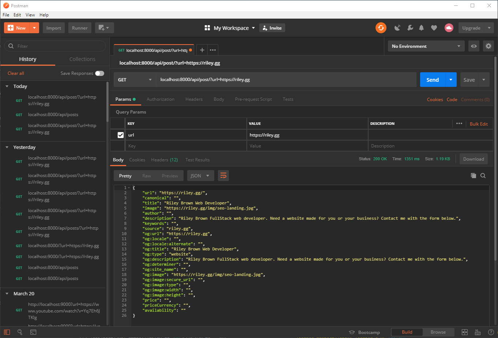

During the course of this sprint, my team and I planned out the features we wanted to add to our project, as well as the database model and technology stack we wanted to use. I faced challenges while trying to think of our data model and what we needed for that. It was also difficult to get postgres setup on my local machine to test back-end features. Another big challenge for our whole team was getting postgres deployed on heroku with migrations and seed data. I created a metadata component on the front-end and set up React router for our routes. I also created a back-end route to parse the metadata href from our front-end.

<h2 class="blog-text-center">Detailed Analysis</h2>

I worked on the front-end and back-end creating key functionality for the Metadata component that parses URL metadata to return a title, image and description from that metadata. I used styled components to style my component on the front-end as well.

_This is the functionality the Metadata component provides:_


First I had to create a route on the backend to send data to. I used the NPM package “url-metadata” to parse a link sent to the route and return metadata from that URL.

```js
router.get("/post", (req, res) => {
  urlMetadata(`${req.query.url}`).then(
    function(metadata) {
      res.json(metadata)
    },
    function(error) {
      console.log(error)
    }
  )
})
```

Next I created the component on the frontend to send data to this route.

```js
export default class MetadataParse extends Component {
  state = {
    image: '',
    description: '',
    title: ''
  };

  componentDidMount() {
    axios.get(`${post}${this.props.children.props.href}`).then(res => {
      this.setState({
        image: res.data.image,
        title: res.data.title,
        description: res.data.description
      });
    });
  }
```

This takes a URL wrapped in the MetadataParse tags and sends it to the backend to be parsed and then returned to the state.

Then I simply return the state from the component in a div in the render.

```js
let metaData = (
  <Post>
    <a href={this.props.children.props.href} target="_blank">
      <h1>{this.state.title}</h1>
      <p>{this.state.description}</p>
      
    </a>
  </Post>
)
return <div>{metaData}</div>
```

I am now able to use this component in multiple different components to return the needed meta tag info for URLs.

```js
export default class Newsfeed extends Component {
  state = {
    users: [],
  }
  render() {
    return (
      <div>
        <MetadataParse>
          <a href="https://riley.gg">test</a>
        </MetadataParse>

        <MetadataParse>
          <a href="https://www.youtube.com/watch?v=HSwjGP19rTg">test</a>
        </MetadataParse>

        <MetadataParse>
          <a href="https://www.youtube.com/watch?v=-W_VsLXmjJU">test</a>
        </MetadataParse>

        <MetadataParse>
          <a href="https://www.youtube.com/watch?v=93p3LxR9xfM">test</a>
        </MetadataParse>
      </div>
    )
  }
}
```

<h2 class="blog-text-center">Milestone Reflections</h2>

I analyzed the TDD and contributed to the data models based on the functionality we needed to create, and brainstormed front-end solutions to our problems. I researched what sort of technology we needed for the URL metadata parsing, and how to implement it accordingly. I found the NPM package that seemed like it would fit our use case, then created a demo express and react app to verify everything would work the
way we needed it to. Once everything was working, I implemented the needed functionality on our front-end and back-end.
