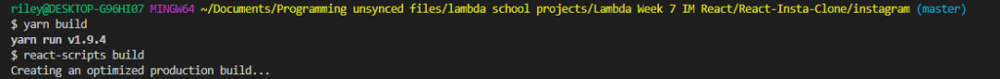
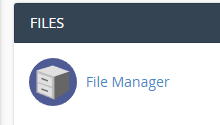
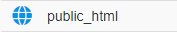
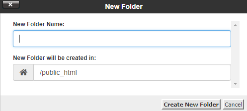
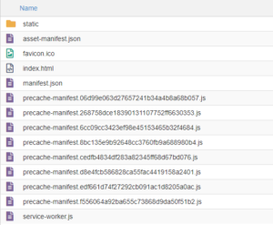

Recently I finished my React Instagram clone project for Lambda School and wanted to share my project on my domain. I could not figure out how to get my site built using my relative domain path
<a href="https://riley.gg/lambda/insta-clone" target="_blank">
(https://riley.gg/lambda/insta-clone)</a>
until I took a look at the <a href="https://github.com/facebook/create-react-app/blob/master/packages/react-scripts/template/README.md#deployment" target="_blank">Create React App docs</a> . It’s quite simple. First, go into your package.json file and add the following:

```js

"homepage": "https://riley.gg/lambda/insta-clone"
```

Replacing my url with the path you want to upload to. My package.json now looks like this:

```js
{
  "name": "instagram",
  "version": "0.1.0",
  "private": true,
  "homepage": "https://riley.gg/lambda/insta-clone",
  "dependencies": {
    "netlify-cli": "^2.0.0",
    "react": "^16.5.2",
    "react-dom": "^16.5.2",
    "react-scripts": "2.0.4",
    "styled-components": "^3.4.10"
  },
  "scripts": {
    "start": "react-scripts start",
    "build": "react-scripts build",
    "test": "react-scripts test",
    "eject": "react-scripts eject"
  },
  "eslintConfig": {
    "extends": "react-app"
  },
  "browserslist": [
    ">0.2%",
    "not dead",
    "not ie <= 11",
    "not op_mini all"
  ]
}

```

Then run your yarn build script (or your npm build script if you’re using npm).



This will create the production version of your React app in a “build” folder, then I simply drag all files from my build folder into the folder I created on my domain. You can use FileZilla for this, or just log directly into your domain control panel and click on File Manager, my domain hosting uses cPanel.



Then click the public_html directory



Any folders/files you put in here can be accessed by anyone on the web. In the top left you should see a +File and +Folder. I don’t want my app to overwrite my root files, so I create a new folder. Whatever you call this folder will be the url in which people can access.



After you make your folder, you can simply hit the upload button at the top and select all the files in your app’s build folder and hit upload



Your app should now be accessible on your relative domain path. Check out my Instagram React clone project <a href="https://riley.gg/lambda/insta-clone/" target="_blank">here</a>
