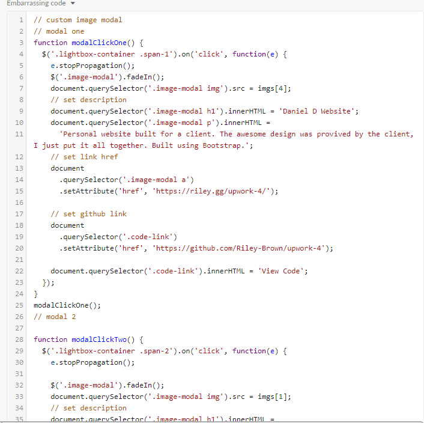

I recently refactored some old code for my portfolio site and was in disbelief how bad the code was.

It was 187 lines of repeating hard-coded jquery logic like the following:



I refactored all of that ugly code to just ~30 lines of beautiful es6 vanilla JS:

```js
// all images inside the image modal content class
const lightboxImages = document.querySelectorAll(".image-modal-content img")

// dynamically selects all elements inside modal popup
const modalElement = element =>
  document.querySelector(`.image-modal-popup ${element}`)

const body = document.querySelector("body")

// closes modal on clicking anywhere and adds overflow back
document.addEventListener("click", () => {
  body.style.overflow = "auto"
  modalPopup.style.display = "none"
})

const modalPopup = document.querySelector(".image-modal-popup")

// loops over each modal content img and adds click event functionality
lightboxImages.forEach(img => {
  const data = img.dataset
  img.addEventListener("click", e => {
    body.style.overflow = "hidden"
    e.stopPropagation()
    modalPopup.style.display = "block"
    modalElement("h1").innerHTML = data.title
    modalElement("p").innerHTML = data.description
    modalElement("a").href = data.url
    modalElement(".secondary-link").href = data.repo
    modalElement("img").src = img.src
  })
})
```

I ended up using HTML5 data attributes to add the dynamic content I wanted in the modal such as title, description and links to the deployed project and GitHub repo. This makes it very easy to maintain and add or edit content to the modal in the future.

```html
<div class="image-modal-content">
  
</div>
```

That's all I need to add to get all of the data I want into the modal, and I can add more fields if I needed to just by adding a new data attribute.

I have a div with the class `image-modal-popup` that is displayed none by default that takes the data attributes and populates the elements inside the modal with the data attribute values when a image inside the `image-modal-content` class is clicked.

```html
<!-- modal popup (displayed none by default) -->
<div class="image-modal-popup">
  <div class="wrapper">
    <span>&times;</span>
    
    <div class="description">
      <h1>This is placeholder content</h1>
      <p>This content will be overwritten when the modal opens</p>
      <a href="#" target="_blank" rel="noopener noreferrer">View Cool Link</a>
      <a
        href="#"
        class="secondary-link"
        target="_blank"
        rel="noopener noreferrer"
        >View Another Link</a
      >
    </div>
  </div>
</div>
```

<h2 class="blog-text-center">Now for the fun JS</h2>

First I select every img tag inside the `.image-modal-content` class using the `document.querySelectorAll` selector and store it in a variable to be used later.

```js
// all images inside the image modal content class
const lightboxImages = document.querySelectorAll(".image-modal-content img")
```

This will return a NodeList object that you can loop over and do things like add events to each node in the list.

Next I create a function to dynamically return certain elements inside of the modal to cut down on repeating DOM selector code.

```js
// dynamically selects all elements inside modal popup
const modalElement = element =>
  document.querySelector(`.image-modal-popup ${element}`)
```

This function simply takes 1 argument that can be either the HTML tag itself (which will only return the 1st element if there are multiple of the same tag) or a class/id. This function returns an element in the DOM which I can then manipulate. I'm using the sweet new es6 backticks to be even easier to read.

Essentially I use this function later on in the code as a dynamic DOM selector like the following:

```js
modalElement("h1").innerHTML = data.title
modalElement("p").innerHTML = data.description
```

Next I add an event listener on the body to close the modal clicking anywhere on the page, and to add overflow back to the page because I remove overflow later on in the code which I will explain more then.

```js
const body = document.querySelector("body")
const modalPopup = document.querySelector(".image-modal-popup")

// closes modal on clicking anywhere and adds overflow back
document.addEventListener("click", () => {
  body.style.overflow = "auto"
  modalPopup.style.display = "none"
})
```

<h2 class="blog-text-center">The main functionality</h2>

Now that we have all of the helper functions and selectors defined, it's time to loop over the NodeList that returns from the `lightBoxImages` variable.

```js
// loops over each modal content img and adds click event functionality
lightboxImages.forEach(img => {
  const data = img.dataset
  img.addEventListener("click", e => {
    body.style.overflow = "hidden"
    e.stopPropagation()
    modalPopup.style.display = "block"
    modalElement("h1").innerHTML = data.title
    modalElement("p").innerHTML = data.description
    modalElement("a").href = data.url
    modalElement(".secondary-link").href = data.repo
    modalElement("img").src = img.src
  })
})
```

This code is rather simple, I am looping over the `lightboxImages` variable and passing in `img` (which can be called anything) that gives us access to each individual item in the NodeList.

Using the `dataset` property we can get access to the data attributes we used in the HTML, I just store it in a variable named data to be more readable.

```js
const data = img.dataset
```

Next I a click event for each individual `img` iteration to take the data from the data attributes and insert them into the modal only on click.

```js
img.addEventListener("click", e => {
  body.style.overflow = "hidden"
  e.stopPropagation()
  modalPopup.style.display = "block"
  modalElement("h1").innerHTML = data.title
  modalElement("p").innerHTML = data.description
  modalElement("a").href = data.url
  modalElement(".secondary-link").href = data.repo
  modalElement("img").src = img.src
})
```

Setting the body overflow to hidden removes the ability for the user to scroll up or down the normal body content while the modal is open. Not only is this good UX but this also makes it so there is only one scroll bar if the modal content needs to overflow (in the css of the modal I set `overflow: auto`).

An important argument to pass in to this listener is the `e` arg, short for event. This allows us to call `e.stopPropagation()` which is very important because earlier we set a listener on the body to close the modal. This prevents the click of the `img` element from closing the modal before it can even open.

Next I set the modal display to `block` using simple DOM manipulation and then use the modalElement function to target elements inside of the modal and set them to values of the `img` data attributes.

Thats it. All the JS we need for a dynamic modal. All of this code can be found on <a href="https://github.com/Riley-Brown/vanilla-js-modal" target="_blank">my GitHub here</a> as well as a <a href="https://codepen.io/RileyB/pen/XQyaXy" target="_blank">live codepen demo </a>

<!--  -->
